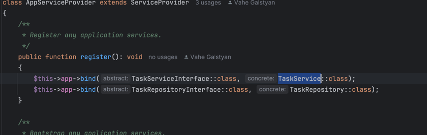

# 📝 Task Tracker API 

A clean and scalable RESTful API service built with Laravel 12 and PHP 8.2+, designed for managing tasks with modern practices like Enums, DTOs, layered architecture, and in-memory repositories.


# 📝 Deploy


---

## 🐳 Getting Started (Docker + Laravel Sail)

### Prerequisites

- [Docker](https://www.docker.com/)
- [Laravel Sail](https://laravel.com/docs/sail)

### Setup

```bash
# Clone the repository
git clone https://github.com/your-username/task-tracker-api.git
cd task-tracker-api

# Install dependencies
composer install

# Start Laravel Sail
./vendor/bin/sail up -d

# Generate app key
./vendor/bin/sail artisan key:generate
```


---

## 🚀 Features

- Create tasks
- Update task status (`todo`, `in_progress`, `done`)
- Assign tasks to users
- Filter tasks by status or assignee
- In-memory repository (no database)

---

## 🧱 Project Structure


## 🛠 Architecture Overview

### Layers

- **Controller Layer**: Handles HTTP requests and responses.
- **Service Layer**: Business logic and orchestration.
- **Repository Layer**: Data access and storage abstraction.
- **Entity/DTO Layer**: Clean models and data transport.
- **Enum Layer**: Type-safe status values.

### Design Patterns Used

| Pattern        | Purpose                                 |
|----------------|------------------------------------------|
| Repository     | Abstracts data storage                  |
| DTO            | Clean data transport                    |
| Dependency Injection | Flexible, testable architecture  |


📬 API Endpoints - Added postman File

### 🧠 Extensibility Plan

### 🗨️ Comments

To support task comments:

- Each task can have **multiple comments** → `One-to-Many` relation.
- A comment should include:
    - **Creator**
    - **Content**
    - **Created at**
    - **Updated at**
- Implementation steps:
    - Create: `CommentEntity`, `CommentDTO`
    - Add: `CommentRepository`, `CommentService`
    - Define the relationship between `Task` and `Comment`
    - Implement: Full CRUD operations for task comments

---

### 👤 User Roles

To support role-based access (e.g., Admin, Developer):

- Define a `UserRoleEnum`, or integrate a full authentication system (e.g., OAuth2).
- Implement authorization logic at the **controller level**.
- Use Laravel’s `FormRequest` classes to centralize validation + authorization.
- Enables permission-based access to task operations.

---

### 🗃️ Database Persistence

To transition from in-memory storage to real database:

- Replace `InMemoryTaskRepository` with a **database-backed repository**, e.g., using Eloquent.
- No need to change service or controller logic thanks to **Dependency Injection (DI)**.
- The app is already wired to allow seamless swapping of implementations via the Laravel **service container**.




## ✅ Justification of Design Decisions & Patterns

This project follows a clean, layered architecture using SOLID principles to ensure a scalable, maintainable, and testable codebase. Below is the rationale for each core component:

### 🧩 Entities & DTOs

- **Entities** (`TaskEntity`, etc.) represent the core business logic and state. They are pure PHP objects not tied to frameworks or persistence layers, making them reusable and test-friendly.
- **DTOs** (`TaskDTO`) serve as a bridge between the application layer and HTTP requests. They encapsulate and validate request data before it reaches the business logic, enforcing strong typing and clean boundaries.

### 🛠 Services

- **Services** (e.g., `TaskService`) hold the core business rules and orchestrate interactions between entities, repositories, and validation.
- They are free of HTTP or infrastructure concerns, making them reusable across CLI, queues, or future GraphQL endpoints.

### 📦 Repositories

- **Repositories** abstract data storage and retrieval logic, using interfaces to allow swapping implementations (e.g., `InMemoryTaskRepository` → Eloquent).
- This allows you to change storage strategy without affecting business or controller logic.

### ✅ Request Validation

- Laravel’s **FormRequest** classes (e.g., `StoreTaskRequest`) handle input validation and authorization.
- They enforce data structure, enum validity, and user permissions at the HTTP layer, keeping controllers slim and clean.

### 🧪 Dependency Injection

- The application binds interfaces to concrete implementations (e.g., `TaskRepositoryInterface` → `InMemoryTaskRepository`) via Laravel’s **Service Container**.
- This ensures low coupling and high flexibility, making the system easy to test, mock, or swap components.

### 💡 Design Patterns Summary

| Pattern         | Purpose                                         |
|------------------|--------------------------------------------------|
| **DTO**          | Transfer clean, validated data into services     |
| **Entity**       | Represent domain models and core logic           |
| **Repository**   | Abstract data storage (e.g., memory, DB, cache)  |
| **Service**      | Encapsulate business logic and coordination      |
| **Enum**         | Restrict status values to valid, safe inputs     |
| **DI (Container)** | Allow flexible component replacement for testing, scalability |

All these choices were made to ensure the system is **modular, testable, extensible**, and easy to evolve as the requirements grow (e.g., adding comments, roles, or persistence).

Absolutely! Here's a more detailed and polished version of the **"Why These Design Patterns?"** section with expanded reasoning for each pattern. You can paste this directly into your `README.md`:

```md
### 🎯 Why These Design Patterns?

To ensure the architecture is clean, testable, and future-proof, the project applies several proven design patterns and principles. Here's why each was chosen:

- **📦 DTOs (Data Transfer Objects)**  
  DTOs isolate input/output data from HTTP requests and responses. They provide type safety, simplify validation, and ensure that only clean, preprocessed data reaches the business logic. This makes it easier to evolve the API without tightly coupling it to internal logic.

- **🧱 Entities**  
  Entities are pure domain objects that model real-world concepts (like `Task`). They encapsulate business rules and behaviors, independent of infrastructure concerns like storage or frameworks. This separation makes them reusable and easy to test.

- **🧠 Services**  
  Service classes encapsulate the application's use cases and coordinate interactions between DTOs, entities, and repositories. Keeping business logic in services instead of controllers ensures modularity, reusability, and easier unit testing.

- **🗂 Repositories**  
  Repositories abstract away the persistence mechanism (e.g., in-memory, database, cache). By relying on interfaces, we can switch implementations without affecting the core logic. This supports scalability and testability, especially during development and future database integration.

- **🎛 Enums**  
  Enums (like `TaskStatusEnum`) enforce a strict set of allowed values, ensuring data consistency and reducing the risk of errors from invalid strings. They also improve code readability and IDE support for status-based logic.

- **🧩 Dependency Injection (DI)**  
  Using Laravel’s DI container allows us to bind interfaces to specific implementations, making the system loosely coupled. This promotes flexibility, enables swapping components (e.g., repositories), and simplifies testing by injecting mock versions where needed.

These design patterns collectively follow the **SOLID principles**:
- **S**ingle Responsibility: Each class handles one job.
- **O**pen/Closed: Components can be extended without modifying existing code.
- **L**iskov Substitution: Interfaces are respected and swappable.
- **I**nterface Segregation: Interfaces are small and focused.
- **D**ependency Inversion: High-level modules rely on abstractions.

This architecture is prepared for real-world evolution, such as adding new features (e.g., comments, user roles) or replacing the storage layer, all with minimal changes to the core logic.
```

### Postman collection
Added postman collection for testing
[Task tracker.postman_collection.json](Task%20tracker.postman_collection.json)


